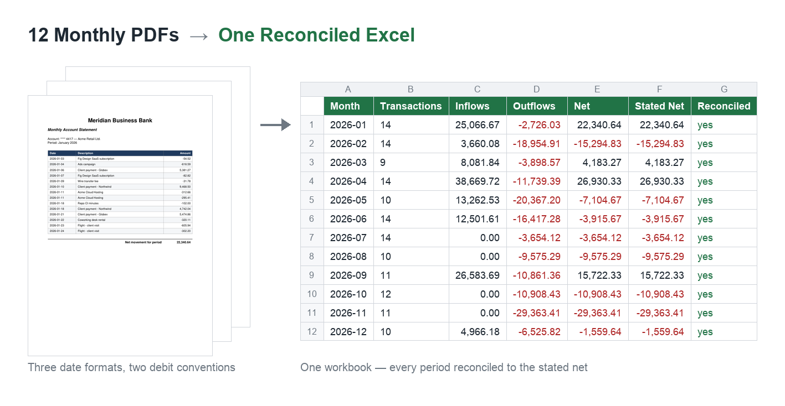

# Monthly PDF Statements → One Reconciled Excel Report

Twelve monthly statements in twelve separate PDFs, consolidated into a single Excel report — with numbers that actually add up.




## The problem

A year of monthly statements arrives as a dozen separate PDFs, each with its own quirks — one uses `2026-01-05`, the next `05/01/2026`, a third writes `Jan 5, 2026`. Debits show up as `-1,234.56` in some files and `(1,234.56)` in others. Consolidating that by hand is a full day of copy-pasting, and a single mistyped figure quietly breaks the totals.

## What this does

Point the script at a folder of statements and it produces one clean workbook:

- **Batch parsing** — reads every PDF in the folder in a single run
- **Format normalisation** — mixed date formats to ISO, mixed debit conventions to signed numbers
- **Categorisation** — transactions grouped by configurable keyword rules
- **Reconciliation** — the computed net is checked against the net printed on each statement; any mismatch is flagged rather than silently absorbed
- **Three sheets** — `Summary` (per-month totals), `By Category` (category × month breakdown), `Transactions` (every row, traceable to its source file)
- **Degrades gracefully** — a statement with a missing description column, unparsable rows or no readable table is warned about in `Summary` and does not sink the rest of the run

## Demo

Running it against the twelve sample statements:

```
statement_2026_01.pdf:  14 tx  net   22,340.64
statement_2026_02.pdf:  14 tx  net  -15,294.83
statement_2026_03.pdf:   9 tx  net    4,183.27
...
statement_2026_12.pdf:  10 tx  net   -1,559.64

12 statements, 143 transactions -> output/report.xlsx
All periods reconcile.
```

A day of manual consolidation becomes a few seconds — and every figure traces back to the file it came from.

## Tech stack

`Python` · `pdfplumber` · `pandas` · `openpyxl`

## Installation

```bash
git clone https://github.com/kholtobin/pdf-statement-merger.git
cd pdf-statement-merger

python -m venv .venv
source .venv/bin/activate        # Windows: .venv\Scripts\activate
pip install -r requirements.txt
```

## Usage

```bash
# generate the synthetic sample statements (optional — they ship with the repo)
python src/generate_samples.py

# consolidate them into one report
python src/merge_statements.py --input samples/ --output output/report.xlsx
```

## Tests

124 tests covering normalisation, statement parsing, report structure and the CLI —
run against both synthetic PDF fixtures and stubbed `pdfplumber` pages.

```bash
pip install -r requirements-dev.txt
pytest
```

## Adapting it

Two places are meant to be tuned per client:

- `CATEGORY_RULES` — keyword → category mapping
- `DATE_FORMATS` — add any additional date convention a provider uses

## Project structure

```
pdf-statement-merger/
├── src/
│   ├── merge_statements.py   # parsing, normalisation, reporting, CLI
│   ├── generate_samples.py   # builds the synthetic statement PDFs
│   └── build_banner.py       # renders assets/before-after.png
├── tests/                    # pytest suite + PDF fixtures
├── samples/                  # 12 synthetic monthly statements
├── assets/                   # README banner
├── output/                   # generated reports (git-ignored)
├── requirements.txt          # runtime deps
├── requirements-dev.txt      # runtime + pytest
├── pytest.ini
└── README.md
```

## Notes

This is a self-initiated demo project. The sample statements are generated from
synthetic data — no real financial or client data is included.

## License

[MIT](LICENSE)
